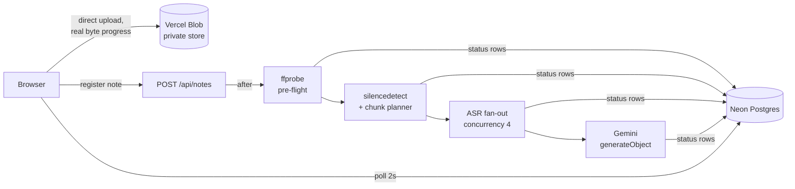

# Gnani Audio Notes

Upload a voice recording, get back a transcript and structured notes — title, TL;DR, key points, action items — with a history of everything you've processed.

Built for the Gnani.ai Full-Stack/AI Engineer assignment. The app lives in [`audio-notes/`](audio-notes/); a deep-dive on the design is served by the app itself at `/architecture`, and the full concept guide is in [`docs/`](docs/).

## The problem worth reading about

Gnani's `/stt/v3` speech-to-text endpoint is **synchronous and accepts at most 60 seconds of audio**. The brief requires handling recordings of **2+ minutes**. The obvious implementation — one API call per file — is impossible by design.

The answer is to split the audio and transcribe the pieces in parallel. But *where* you split is the whole game: a blind cut every 30 seconds lands mid-word, and the ASR model hears half a word on each side of every seam and produces garbage there. So this pipeline asks ffmpeg where the speaker **paused**:

1. `silencedetect` finds every gap of ≥300 ms below −30 dB
2. A planner cuts at the pause nearest each 25-second target, never exceeding a 30-second hard cap
3. If someone talks for 30 straight seconds without breathing, we cut anyway — the API limit is not negotiable, and one clipped word beats a rejected request

In practice a 2-minute recording becomes ~5 chunks whose boundaries all land inside real silences, and the seams are invisible in the final transcript.

## Pipeline



- **Upload** goes browser → Blob directly via a short-lived scoped token. The server never relays file bytes, and the browser gets true upload progress.
- **Pre-flight**: `ffprobe` proves the file is really audio and within limits (10 min / 40 MB) before a single API credit is spent. A PDF renamed to `.mp3` dies here in ~200 ms with a human-readable error.
- **Fan-out**: a worker pool sends chunks to Gnani at concurrency 4. Transient failures (429/5xx/network) retry up to 3× with exponential backoff; permanent ones (400) never retry — the audio will be exactly as rejected the fourth time as the first.
- **Background work without a queue**: the create request returns instantly; the pipeline runs in Next.js `after()`, writing every stage change and chunk result to Postgres. The UI polls every 2 s and renders exactly what the database says — the progress counter is a count of real rows, not an animation.
- **Failure is a feature**: a chunk that exhausts its retries becomes a visible, timestamped gap marker in the transcript. The note completes as *done with gaps* and offers a retry that re-runs **only the failed segments** — finished audio is never re-transcribed or re-billed. Jobs killed mid-flight are swept by a stale-job reaper (opportunistic + cron).

## Stack

| Layer | Choice | Why |
|---|---|---|
| App | Next.js 16 App Router on Vercel | One deployable for UI + API + background work |
| Database | Neon Postgres (HTTP driver) | Stateless per-query connections — the right shape for serverless |
| Storage | Vercel Blob, **private** store | Recordings never sit on guessable public URLs |
| Audio | Bundled `ffmpeg`/`ffprobe` binaries | Probing, silence detection, cutting, resampling to the 16 kHz mono the ASR wants |
| ASR | Gnani `/stt/v3` | The assignment's subject |
| Summary | AI SDK `generateObject` + Gemini | A zod schema makes a malformed response a caught error, not a broken page |
| Identity | Anonymous httpOnly cookie | Every query is session-scoped; nothing for a reviewer to sign up for |

## Running locally

```bash
cd audio-notes
npm install
cp .env.example .env.local   # fill in the values (see .env.example for where each comes from)
npm run db:init              # applies lib/schema.sql to your Neon database (idempotent)
npm run dev
```

End-to-end smoke test against the running dev server (uploads a file, registers a note, polls to completion):

```bash
node --env-file=.env.local scripts/e2e-smoke.mjs path/to/recording.wav
```

## Repository layout

```
audio-notes/
  app/                 pages + API routes (upload token, notes CRUD, polling, retry, cron reaper)
  lib/audio.ts         ffprobe pre-flight, silence detection, chunk planner, extraction
  lib/gnani.ts         STT client: transient-vs-permanent retry policy
  lib/pool.ts          fixed-size concurrency pool with per-settle progress callback
  lib/pipeline.ts      the background job that ties it all together
  lib/summary.ts       structured summary via Gemini, model fallback
  lib/schema.sql       notes + chunks tables (chunk rows are what make progress & retry real)
  scripts/             db-init, e2e smoke test
docs/                  concept guide: architecture narrative, all 15 design decisions, glossary
```
